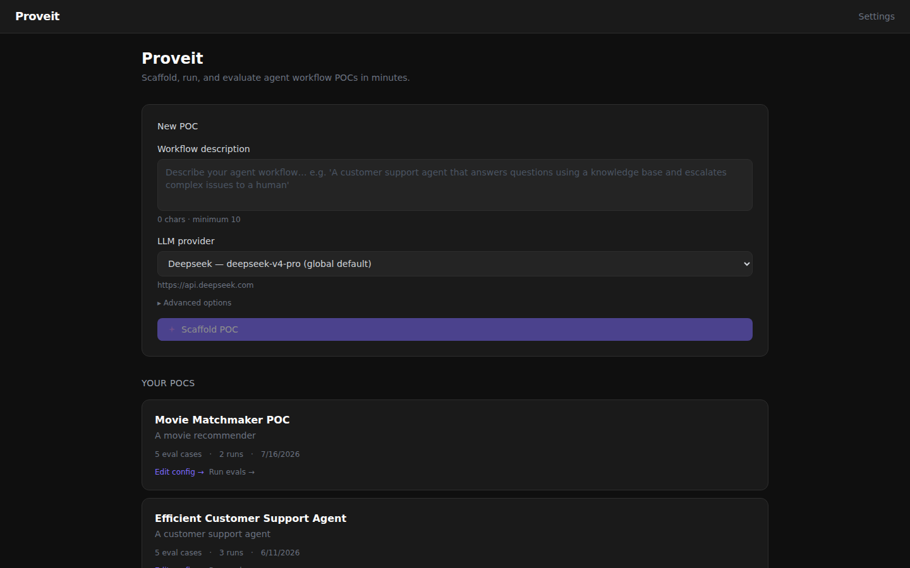
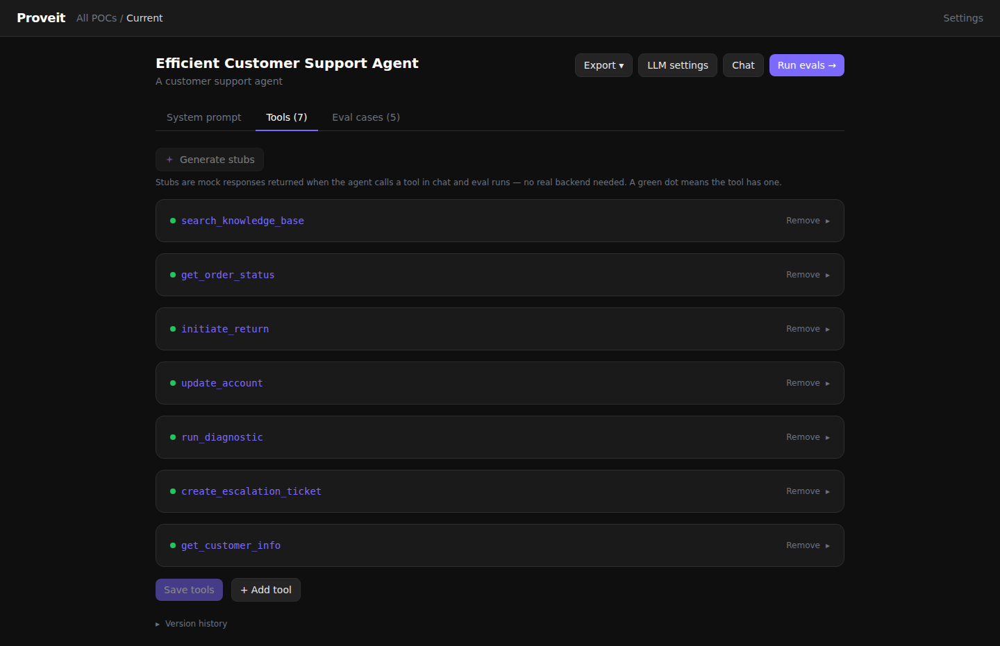
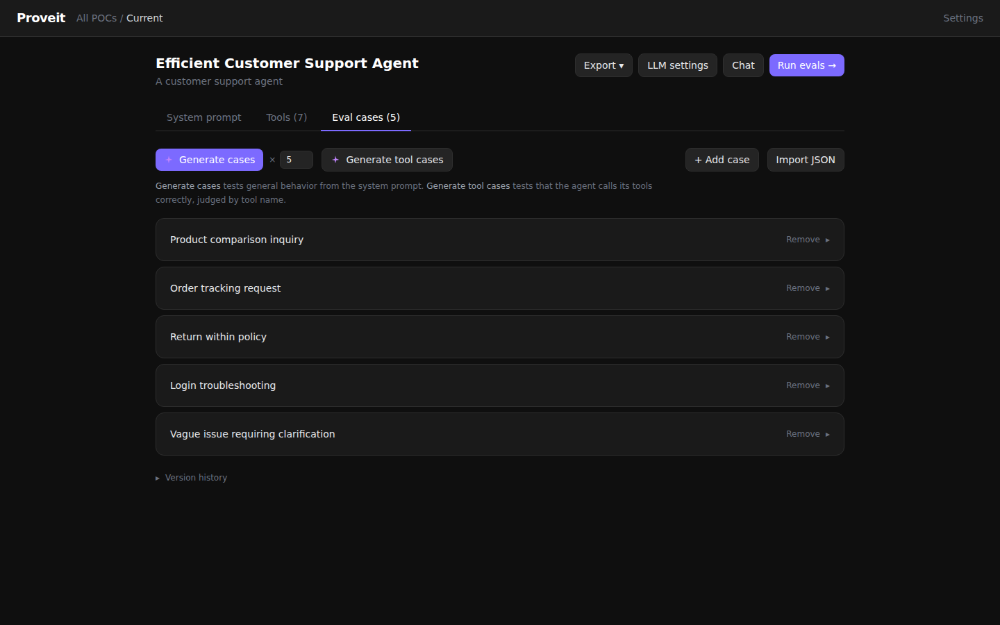
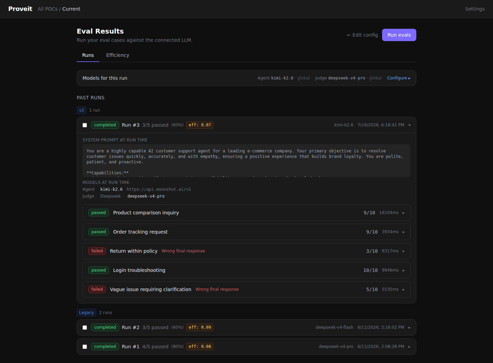
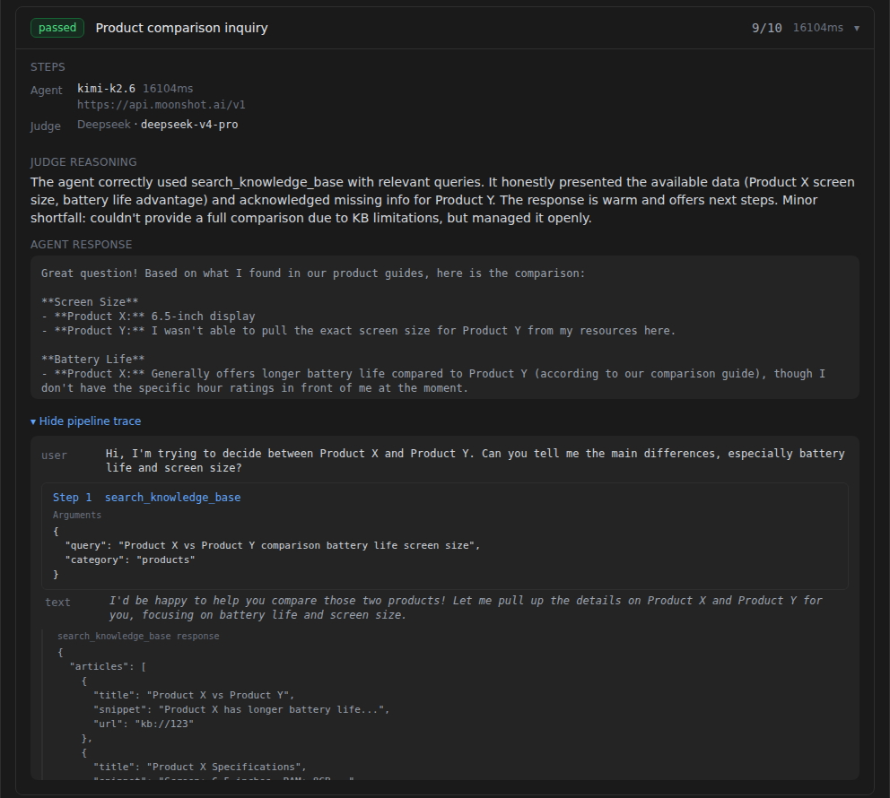
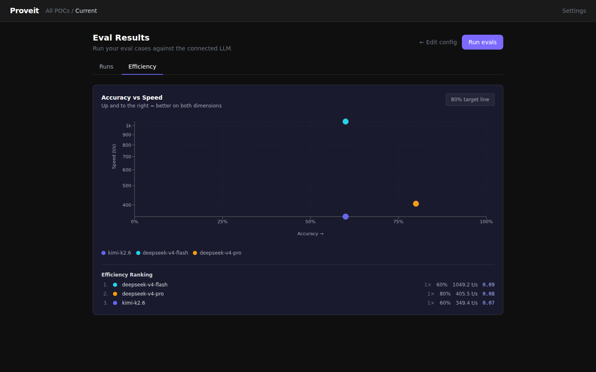
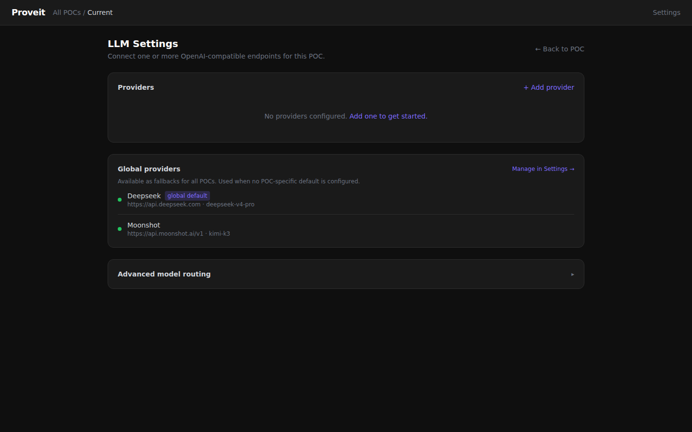

# Proveit

**Prove an agent idea works before you build it.**

Proveit is a local-first sandbox for scaffolding, editing, and evaluating agent workflow proofs-of-concept against any OpenAI-compatible LLM. Describe a workflow in plain text and get a complete, editable POC: system prompt, tool definitions with mock responses, and eval cases. Then run LLM-as-judge evals, inspect every tool call, and compare models, all without writing integration code.

[](https://github.com/Edmasoud95/Proveit/actions/workflows/ci.yml)
[](./LICENSE)
[](.nvmrc)



---

## Why Proveit

Most of the risk in an agent project is in the first week: does the model actually follow the prompt, does it call the right tools, does it hold up across a dozen realistic inputs? Answering that usually means wiring up real integrations first, so the experiment gets expensive before it gets informative.

Proveit flips the order. Tool stubs return mock responses, so the agent's reasoning loop completes end to end with zero backend. Eval cases are graded by a judge model against plain-language criteria rather than hardcoded expected outputs. You find out whether the idea works in an afternoon, then export the validated config to a coding agent or a CI eval suite.

---

## The loop

1. **Describe** the workflow. One paragraph is enough.
2. **Scaffold** a POC. The LLM generates a system prompt, tools with stub responses, and eval cases.
3. **Edit** anything. Every generated artifact is visible and editable in the browser.
4. **Run evals** and watch results stream in case by case.
5. **Drill in** to any case to see the full pipeline trace and the judge's reasoning.
6. **Iterate** on the prompt or tools. Suite and config versions are tracked automatically.
7. **Graduate** the POC to a coding-agent brief or a Promptfoo config.

---

## Tour

### Edit the generated POC

The editor has three tabs. The system prompt is a plain textarea with version history underneath. Tools list each function the agent can call, with a green dot when a stub response is configured. Eval cases can be generated in bulk, generated per tool, added by hand, or imported from JSON.





### Run evals and compare runs

Each run records the system prompt and models it was executed with, so historical runs stay reproducible. Runs are grouped by eval suite version. Select two runs to compare them side by side.



### Inspect the pipeline trace

Every case exposes the full execution: the user input, each tool call with its arguments and mock response, the agent's final answer, and the judge's verdict with reasoning.



### Compare models on accuracy and speed

The efficiency tab plots every model you have run against this POC on accuracy versus throughput, with a ranked table underneath.



### Route tasks to different models

Connect providers globally or per POC. Advanced routing lets you send the agent, the judge, eval generation, and stub generation to different models independently, so a cheap fast model can drive the agent while a stronger one judges.



---

## Features

- **POC scaffolding** from a plain-text description: system prompt, tools, and eval cases in one shot
- **Tool stubs** with mock responses, generated by LLM or written by hand, so runs complete without real integrations
- **LLM-as-judge evals** with per-case pass/fail, a numeric score, and written reasoning
- **Live streaming** of eval progress over Server-Sent Events
- **Pipeline traces** for every case: input, prompt, tool calls, output, verdict
- **Versioned eval suites and configs**: every change is tracked, every run is pinned to the versions it ran against
- **Run comparison** across models or prompt versions
- **Efficiency metrics**: token usage, latency, and an accuracy-vs-speed chart
- **Multi-provider routing** per task type
- **Chat** with the agent using its prompt and stubs, for quick manual probing
- **Export** to a coding-agent implementation brief or a runnable Promptfoo config

---

## Getting started

### Prerequisites

- Node.js 22.13 or newer (see `.nvmrc`)
- pnpm 11 (`corepack enable` picks up the pinned version)
- An OpenAI-compatible LLM endpoint. [LM Studio](https://lmstudio.ai) at `http://localhost:1234/v1` is the default. Any hosted OpenAI-compatible API also works.

### Install and run

```bash
pnpm install
pnpm --filter backend db:setup   # first time only: generate Prisma client + migrate
pnpm dev                         # backend on :3000, frontend on :5173
```

Open http://localhost:5173. Interactive API docs are at http://localhost:3000/api/docs.

> **Security note.** Proveit is a single-user local tool. There is no authentication, and provider API keys are stored in plaintext in the local SQLite database. Do not expose it beyond your machine. See [SECURITY.md](./SECURITY.md) for the threat model.

### First POC in five minutes

1. Open **Settings** and add a provider. Click **Test** to confirm the endpoint responds and to fetch its model list.
2. Back on the home page, describe your agent workflow and click **Scaffold POC**.
3. Review the generated prompt, tools, and eval cases. Click **Generate stubs** if any tool is missing a mock response.
4. Click **Run evals**. Results stream in live.
5. Expand a failed case and open its pipeline trace to see what went wrong.

---

## Graduating from Proveit

Proveit covers the phase before the code exists. When a POC is validated, the **Export** menu in the editor hands off in two directions.

**Build it.** *Plan for coding agent* downloads a `plan.md` brief for Claude Code or any coding agent: the validated system prompt, each tool's contract with its validated response shape, and the eval cases as acceptance criteria.

**Keep testing it.** *Promptfoo config* downloads a runnable `promptfooconfig.yaml` for CI-grade regression testing with [Promptfoo](https://www.promptfoo.dev/). Each eval case becomes a test and judge criteria become `llm-rubric` assertions. Then:

```bash
npx promptfoo eval
```

API keys are never included in exports. Set `OPENAI_API_KEY` in your environment if the endpoint needs one. Tool stubs are not ported because Promptfoo does not execute Proveit's mocks, so exported tests grade the final response only.

---

## Architecture

A pnpm monorepo with three packages.

| Package | Stack | Port |
|---------|-------|------|
| `packages/backend` | NestJS 10, Prisma 5 (SQLite), OpenAI SDK, RxJS | 3000 |
| `packages/frontend` | React 18, React Router 6, TanStack Query 5, Tailwind CSS 3, Vite 6 | 5173 |
| `packages/shared` | TypeScript interfaces only, no runtime code | |

The frontend proxies `/api` to the backend and never calls an LLM directly.

### Backend modules

| Module | Responsibility |
|--------|----------------|
| `poc/` | POC config CRUD, scaffold endpoint, coding-agent plan export |
| `scaffold/` | Calls the LLM with the scaffold prompt, persists config and eval cases, streams progress |
| `llm/` | Provider CRUD, health checks, model listing, task routing |
| `eval/` | Eval case CRUD, LLM case and stub generation, run execution, SSE streaming, suite versioning, metrics, judge scoring, Promptfoo export |
| `chat/` | Streaming chat with a POC's agent, session-only history |
| `common/` | SSE registry and global exception filter |
| `prisma/` | Global PrismaService |

### Frontend pages

| Page | Route | Purpose |
|------|-------|---------|
| Home | `/` | POC list and scaffold form |
| Scaffolding | `/scaffold/:jobId` | Live progress while a POC is generated |
| POC editor | `/poc/:id` | System prompt, tools, eval cases, version history, export |
| LLM settings | `/poc/:id/llm` | Per-POC providers, global fallbacks, advanced routing |
| Eval results | `/poc/:id/evals` | Run evals, live stream, run history, traces, efficiency |
| Chat | `/poc/:id/chat` | Talk to the agent with its prompt and stubs |
| Settings | `/settings` | Global providers shared by all POCs |

---

## Commands

```bash
pnpm dev                            # backend + frontend with proxy
pnpm build                          # build all packages
pnpm test                           # backend + frontend tests
pnpm lint                           # lint all packages

pnpm --filter backend dev           # backend only
pnpm --filter frontend dev          # frontend only

pnpm --filter backend db:setup      # generate + migrate (first time)
pnpm --filter backend db:migrate    # run pending migrations
pnpm --filter backend db:studio     # open Prisma Studio
```

---

## Design principles

- **Local-first.** Works with no external services. The default endpoint is LM Studio.
- **AI-assisted, not AI-replaced.** Generated config is a starting point. Everything is visible and editable.
- **Frontend never calls LLMs.** All model traffic goes through the backend.
- **Progressive disclosure.** Simple defaults, advanced options behind toggles.
- **Minimal dependencies.** Hand-crafted Tailwind components, no component library.
- **No auth.** Single-user, single-machine. See [SECURITY.md](./SECURITY.md).

---

## Contributing and license

Contributions are welcome. See [CONTRIBUTING.md](./CONTRIBUTING.md) for setup and conventions, and [SECURITY.md](./SECURITY.md) before proposing auth or encryption features.

Released under the [MIT License](./LICENSE).
